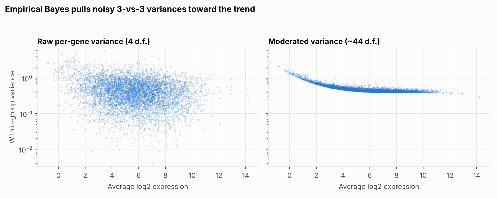
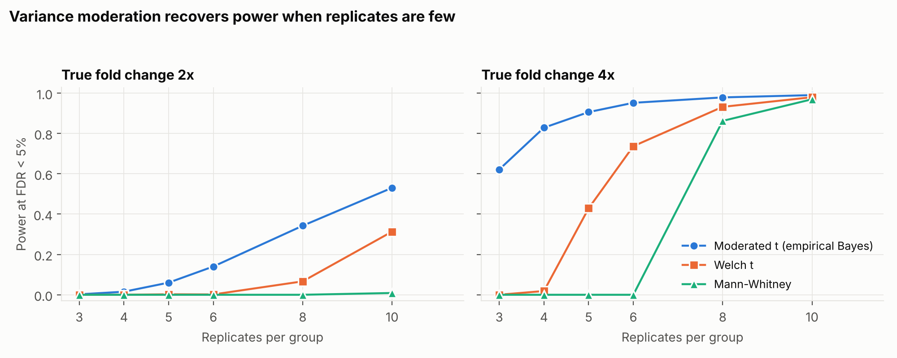
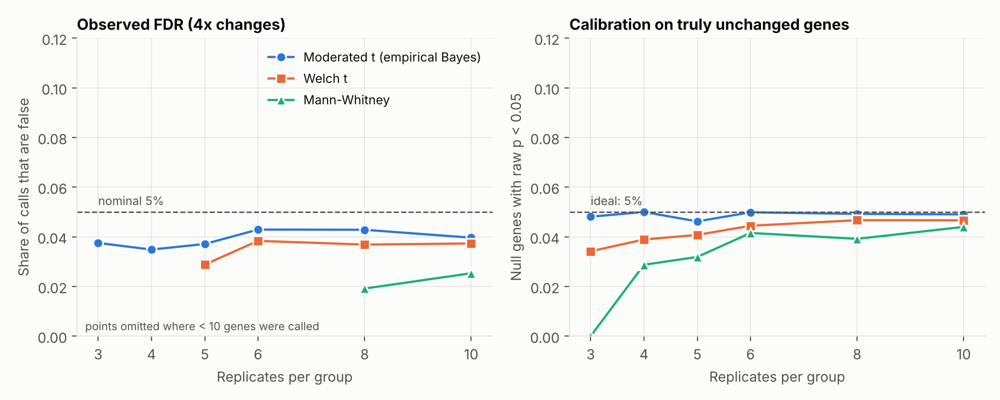
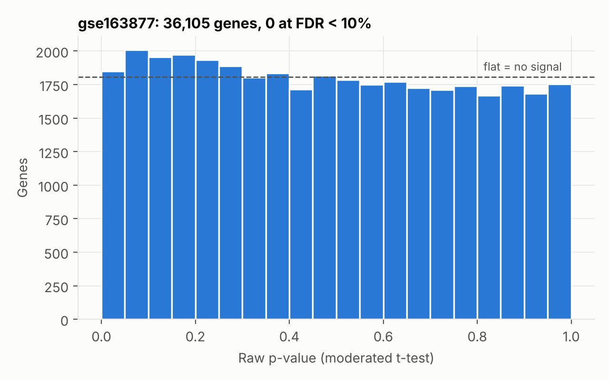

# count-de-benchmark

[](https://github.com/iraajgangavaram/count-de-benchmark/actions/workflows/tests.yml)

**Differential expression for small RNA-seq experiments, implemented from
scratch and benchmarked against known ground truth.**

Most RNA-seq studies have only three to six replicates per group. This project
asks a concrete question: *with so few samples, how much does the choice of
statistical test change what you can discover, and how many of your discoveries
are wrong?* It implements an empirical-Bayes moderated t-test (the idea behind
limma), compares it with Welch's t-test and the Mann-Whitney test on thousands
of simulated experiments where the truth is known, and then applies all three to
a real public dataset.

> **Headline results**
> - With **3 replicates per group and 4x true changes**, the moderated test
>   recovers **62%** of truly changed genes at a 5% FDR target, with an observed
>   FDR of 3.8%. Welch's t-test and Mann-Whitney recover **0%**.
> - Mann-Whitney **cannot** call anything significant with 3 vs 3 samples at
>   genome scale, for a mathematical reason shown below.
> - On the real Alzheimer's-disease dataset GSE163877 (3 vs 4 samples), **no
>   method finds a gene at 10% FDR** and the p-value histogram is essentially flat.
>   The dataset is too small to detect anything but very large effects.

## Contents

1. [Method](#method)
2. [Simulation benchmark](#simulation-benchmark)
3. [Results](#results)
4. [Real-data application: GSE163877](#real-data-application-gse163877)
5. [Usage](#usage)
6. [Validation and testing](#validation-and-testing)
7. [Limitations](#limitations)
8. [Repository layout](#repository-layout)
9. [References](#references)

## Method

```text
raw counts -> median-of-ratios size factors -> low-count filter
           -> log2 counts-per-million -> per-gene test -> Benjamini-Hochberg FDR
```

**1. Normalisation.** Median-of-ratios size factors (Anders and Huber 2010): each
sample is divided by the median, over genes with non-zero counts in every
sample, of its ratio to the per-gene geometric mean. This corrects for library
depth and is robust to a minority of strongly changed genes.

**2. Filtering.** Genes with fewer than `min_total_count` reads (default 10) are
dropped before testing, which reduces the multiple-testing burden. Size factors
are estimated on all genes first.

**3. Transformation.** `log2((normalised count + 0.5) / (mean library size + 1) * 1e6)`.
The prior count stabilises low counts. All samples share one scaling constant,
so the transformation is a pure shift of `log2(norm + 0.5)` and does not
reintroduce composition effects.

**4. Tests** (selectable with `--method`):

| Method | Description |
|---|---|
| `moderated` (default) | Empirical-Bayes moderated t-test, implemented in `countde/ebayes.py` following Smyth (2004). |
| `welch` | Welch's two-sample t-test on log-CPM. |
| `mannwhitney` | Two-sided Mann-Whitney U (rank-sum) test on log-CPM. |

**Moderated t-test in brief.** With only 4 residual degrees of freedom (3 vs 3),
each gene's variance estimate is extremely noisy: some genes look spuriously
stable (huge t-statistics), others spuriously noisy. The empirical-Bayes model
treats true gene variances as draws from a scaled inverse chi-square
distribution, `sigma_g^2 ~ s0^2 * d0 / chi2(d0)`, estimates the prior variance
`s0^2` and prior degrees of freedom `d0` from the ensemble of all genes by
moment matching on the log-variance scale (using digamma/trigamma functions),
and replaces each variance by a posterior value

```text
s2_posterior = (d0 * s0^2 + d * s2_gene) / (d0 + d)
```

The moderated t-statistic then has `d0 + d` degrees of freedom. The prior
`s0^2` follows a cubic-polynomial trend in average expression, because
variance in log-scale RNA-seq data falls with expression. The figure shows the
effect on one simulated 3-vs-3 experiment: raw variances are scattered over two
orders of magnitude, posterior variances follow the trend.



**5. Multiple testing.** Benjamini-Hochberg adjusted p-values (Benjamini and
Hochberg 1995).

**Why Mann-Whitney is hopeless at 3 vs 3.** With 3 vs 3 samples and no ties,
the most extreme possible arrangement has two-sided exact p = 2 / C(6,3) =
**0.1**. No gene can ever have a raw p-value below 0.1, so no adjusted p-value
can fall below 0.1 either, regardless of effect size. This is asserted in the
test suite.

## Simulation benchmark

Counts are generated from a negative-binomial (gamma-Poisson) model, so the
true differentially expressed genes are known exactly (`countde/simulate.py`):

- 5,000 genes; gene means log-normal with median 100 and log-sd 1.5
- 10% of genes truly changed (half up, half down) by a fixed fold change (2x or 4x)
- variance `mu + phi * mu^2` with common dispersion `phi = 0.2` (varied below)
- per-sample library sizes log-normal (sd 0.25), so normalisation matters
- 10 independent simulated experiments per setting, all methods run on the same data

**Metrics** (genes called at adjusted p < 0.05):

- *Power*: fraction of all truly changed genes that are called (genes removed by
  the filter count as missed, so low-count genes are not hidden)
- *Observed FDR*: fraction of called genes that are not truly changed (nominal: 5%)
- *AUC*: how well raw p-values rank true genes above null genes, independent of any threshold
- *Null calibration*: fraction of truly unchanged genes with raw p < 0.05 (ideal: 5%)

## Results



**Power at 5% FDR target** (4x true change; full tables in `docs/results/`):

| Replicates per group | Moderated | Welch | Mann-Whitney |
|---:|---:|---:|---:|
| 3  | **0.621** | 0.000 | 0.000 |
| 4  | **0.829** | 0.019 | 0.000 |
| 5  | **0.906** | 0.429 | 0.000 |
| 6  | **0.952** | 0.737 | 0.000 |
| 8  | 0.979 | 0.932 | 0.862 |
| 10 | 0.990 | 0.980 | 0.970 |

**Power at 5% FDR target** (2x true change):

| Replicates per group | Moderated | Welch | Mann-Whitney |
|---:|---:|---:|---:|
| 3  | 0.002 | 0.000 | 0.000 |
| 4  | 0.015 | 0.000 | 0.000 |
| 5  | 0.060 | 0.002 | 0.000 |
| 6  | 0.140 | 0.002 | 0.000 |
| 8  | 0.342 | 0.067 | 0.000 |
| 10 | 0.530 | 0.313 | 0.009 |

**What these results show**

- **Moderation matters most when replicates are fewest.** At 4x changes with
  3-5 replicates the moderated test is the only method with meaningful power.
  By 10 replicates all three methods converge.
- **It is not magic.** At 2x changes with 3 replicates even the moderated test
  finds essentially nothing (power 0.002). A 2x change is a typical effect size
  in real biology, so small experiments remain badly underpowered for it.
- **Ranking is better than calling.** AUC is higher for the moderated test at
  every design (for example 0.979 vs 0.945 for Welch at 3 vs 3, 4x), so moderation
  improves the ordering of genes and not only the significance cut-off.



- **Error control holds.** For the moderated test, observed FDR is 3.5-4.3% at
  4x changes (nominal 5%). At 2x changes it is 3.0-4.2% wherever at least 70
  genes are called, with one value just above nominal (5.1% at 5 replicates,
  about 31 calls, within sampling noise). P-values for genuinely unchanged genes
  are well calibrated (4.6-5.2% fall below 0.05 in every design). Welch and
  Mann-Whitney are conservative in small designs: they control FDR by calling
  almost nothing.
- **Sensitivity to biological variability** (3 vs 3, 4x change, power):

| Dispersion | Moderated | Welch | Mann-Whitney |
|---:|---:|---:|---:|
| 0.05 | 0.968 | 0.052 | 0.000 |
| 0.10 | 0.925 | 0.002 | 0.000 |
| 0.20 | 0.621 | 0.000 | 0.000 |
| 0.40 | 0.050 | 0.000 | 0.000 |
| 0.80 | 0.000 | 0.000 | 0.000 |

  Noisy systems erase the advantage: at dispersion 0.4 the moderated test has
  almost no power (0.050) for 4x changes with 3 replicates, and none at 0.8. Where observed FDR
  is reported for very few calls (for example in the dispersion table) it is
  dominated by sampling noise; the figure above omits points with fewer than 10 calls.

## Real-data application: GSE163877

To check how the methods behave outside simulation, all three were applied to
raw counts from **GSE163877**, human post-mortem middle temporal gyrus
comparing **3 Alzheimer's disease and 4 control** samples (58,825 genes; 36,105
retained after the low-count filter). The counts are the matrix used in my
[Transcriptomic-Biomarker-Analysis](https://github.com/iraajgangavaram/Transcriptomic-Biomarker-Analysis)
project.

| Method | Genes with raw p < 0.05 | Expected by chance | Genes at FDR < 10% | Estimated null fraction |
|---|---:|---:|---:|---:|
| Moderated t | 1,848 | 1,805 | **0** | 0.96 |
| Welch t | 1,339 | 1,805 | **0** | 0.99 |
| Mann-Whitney | 214 | 1,805 | **0** | 1.00 |



**Interpretation.** The number of genes with p < 0.05 under the moderated test
is essentially what is expected by chance alone, the histogram is flat apart
from a mild excess of small p-values, and Storey's null-fraction estimate is
0.96. In plain terms: *with 7 samples this dataset provides no statistically
reliable evidence of differentially expressed genes between the groups, under
any of the three methods.* That is consistent with the simulation, which shows
power near zero for 3 vs 3-4 samples unless effects are large and variability low.

This is a statement about statistical power, not about biology: Alzheimer's
disease may well involve transcriptional changes that a 7-sample study cannot
detect. Gene lists from this dataset should be treated as hypothesis-generating
at most, and enrichment results built on top-ranked genes inherit that caveat.

**Agreement with the earlier analysis.** The log2 fold changes from the
moderated test correlate strongly with those from the earlier t-test pipeline
(Spearman 0.996, 36,105 genes), and -log10 p-values correlate at 0.93. The top-100
gene lists overlap on only 16 genes, which is expected when the ranking is
driven by noise. The earlier results file has an empty adjusted-p-value column,
so only p-value agreement, not FDR calls, could be compared.

Reproduce with `scripts/reanalyse_real_counts.py` (see below). The summary is in
`docs/results/gse163877_summary.json`.

## Usage

```bash
pip install -e ".[figures,test]"

# Differential expression on your own data
python -m countde run counts.csv samples.csv --reference control \
    --method moderated -o results.csv

# Reproduce all benchmark tables and figures (about 20 seconds)
python scripts/make_figures.py --reps 10

# Re-analyse a real dataset and report how much signal there is
python scripts/reanalyse_real_counts.py --counts counts.csv --samples samples.csv \
    --reference Control --name my_dataset
```

- `counts.csv`: gene IDs in the first column, **raw integer counts** per sample.
- `samples.csv`: columns `sample,group`; exactly two groups, at least two samples each.
- `log2_fold_change` is (non-reference group) / reference, on the log-CPM scale.

Python API:

```python
from countde import differential_expression, simulate_counts, evaluate

sim = simulate_counts(n_per_group=3, fold_change=4.0, seed=1)
res = differential_expression(sim.counts, sim.groups, method="moderated")
print(evaluate(res, sim.is_de, alpha=0.05))   # power, observed FDR, AUC, calibration
```

## Validation and testing

`pytest` runs 39 tests. Highlights:

- **Hand-checked statistics:** Benjamini-Hochberg against worked examples,
  trigamma inverse round-trips, the exact minimum Mann-Whitney p-value.
- **Recovery of known parameters:** the empirical-Bayes estimator recovers the
  prior degrees of freedom to within 10% and the prior variance to within 5%
  from 30,000 simulated genes, including under a mean-variance trend.
- **Behavioural claims:** variance moderation rescues power at 3 replicates,
  p-values for unchanged genes are calibrated, FDR is controlled with adequate
  replication, size factors recover simulated library sizes to within 5%.
- **Edge cases:** constant genes, too few genes to moderate, missing labels,
  invalid counts, unknown methods.
- **CI:** GitHub Actions runs the suite on Python 3.10-3.12.

The empirical-Bayes module is validated against simulated ground truth, **not**
against the R `limma` package.

## Limitations

- This is a log-CPM, linear-model approach (in the spirit of limma-trend). It
  does not fit a negative-binomial model, so it does not replace DESeq2 or edgeR,
  and **neither of those is benchmarked here**.
- The simulation uses one common dispersion and independent genes; real data
  has gene-specific dispersion, correlation between genes and outliers.
- Two-group comparisons only; no covariates, batch terms or paired designs.
- Genes need non-zero counts in every sample to contribute to size-factor
  estimation, so very sparse data (for example single-cell) is unsuitable.
- Results depend on the simulation settings; they illustrate behaviour and are
  not universal performance figures.

**Possible extensions:** a negative-binomial GLM with shrunken dispersions, a
head-to-head benchmark against DESeq2/edgeR/limma in R, and design matrices
for covariates.

## Repository layout

```text
countde/          package: normalize, ebayes, de, simulate, benchmark, cli
scripts/          make_figures.py, reanalyse_real_counts.py
tests/            pytest suite (39 tests)
docs/figures/     generated figures
docs/results/     generated tables and the real-data summary
.github/workflows/tests.yml
```

## References

- Anders S, Huber W (2010). Differential expression analysis for sequence count data. *Genome Biology* 11:R106.
- Benjamini Y, Hochberg Y (1995). Controlling the false discovery rate. *Journal of the Royal Statistical Society B* 57:289-300.
- Law CW, Chen Y, Shi W, Smyth GK (2014). voom: precision weights unlock linear model analysis tools for RNA-seq read counts. *Genome Biology* 15:R29.
- Love MI, Huber W, Anders S (2014). Moderated estimation of fold change and dispersion for RNA-seq data with DESeq2. *Genome Biology* 15:550.
- Ritchie ME et al. (2015). limma powers differential expression analyses for RNA-sequencing and microarray studies. *Nucleic Acids Research* 43:e47.
- Robinson MD, McCarthy DJ, Smyth GK (2010). edgeR: a Bioconductor package for differential expression analysis of digital gene expression data. *Bioinformatics* 26:139-140.
- Schurch NJ et al. (2016). How many biological replicates are needed in an RNA-seq experiment and which differential expression tool should you use? *RNA* 22:839-851.
- Smyth GK (2004). Linear models and empirical Bayes methods for assessing differential expression in microarray experiments. *Statistical Applications in Genetics and Molecular Biology* 3:Article 3.
- Storey JD (2002). A direct approach to false discovery rates. *Journal of the Royal Statistical Society B* 64:479-498.

## Author

Iraaj Gangavaram
